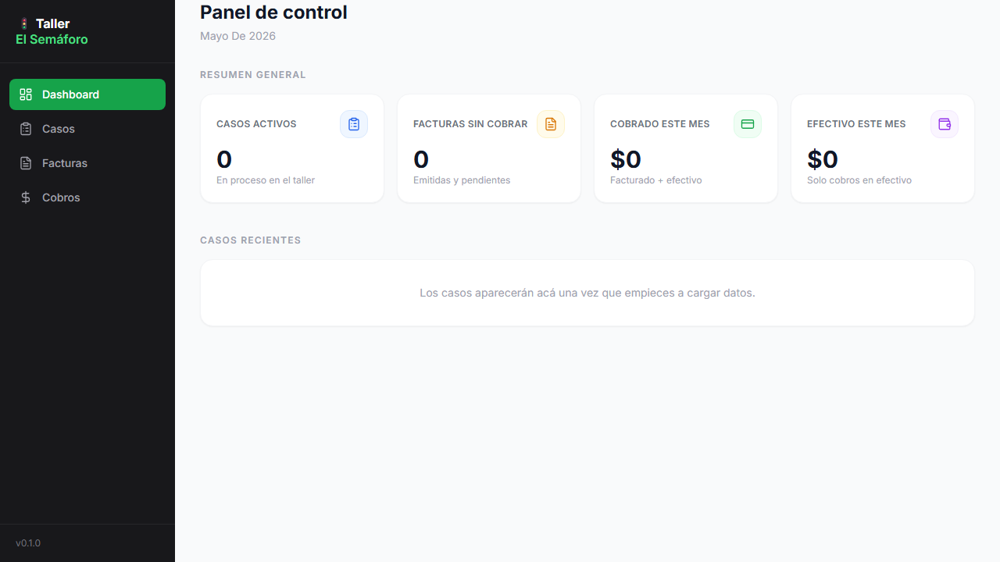

# Taller El Semáforo — App de gestión para taller

Proyecto en desarrollo de una aplicación web para la gestión operativa de un taller de chapa y pintura.

El objetivo del MVP es centralizar información de casos, presupuestos, facturas y cobros para mejorar el seguimiento administrativo y la trazabilidad del trabajo.

## Estado actual

Proyecto inicial / MVP en desarrollo.

Actualmente incluye:

- Dashboard visual inicial con métricas simuladas.
- Layout responsive con sidebar para desktop y navegación superior en mobile.
- Componentes reutilizables para tarjetas de indicadores.
- Configuración inicial con Next.js, TypeScript y Tailwind CSS.
- Cliente InsForge preparado para conectar con backend/BaaS mediante variables de entorno.

## Tecnologías

- Next.js
- TypeScript
- React
- Tailwind CSS
- InsForge SDK
- Lucide React
- Git / GitHub

## Estructura principal

```text
app/               Pantallas principales de Next.js
components/        Componentes reutilizables
lib/               Configuración de clientes externos
screenshot.png     Captura del estado actual de la UI
```

## Captura



## Configuración local

1. Instalar dependencias:

```bash
npm install
```

2. Crear archivo de variables de entorno:

```bash
cp .env.example .env.local
```

3. Completar `.env.local` con las credenciales del proyecto InsForge.

4. Ejecutar en modo desarrollo:

```bash
npm run dev
```

5. Abrir en el navegador:

```text
http://localhost:3000
```

## Próximos pasos

- Crear tablas reales en InsForge.
- Conectar el dashboard a datos reales.
- Implementar carga de casos.
- Implementar listado de casos.
- Implementar carga de facturas y cobros.
- Agregar autenticación y roles.
- Documentar el modelo de datos.
- Preparar deploy en Vercel.

## Nota

Este proyecto forma parte de un portfolio académico/profesional en desarrollo. No representa todavía un producto terminado ni listo para uso real en producción.
